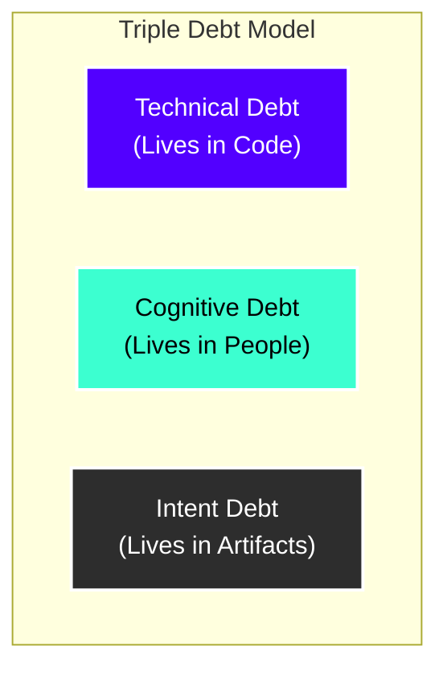

> **Status:** Forward-looking roadmap. Items here are plans, not claims about shipped behavior.

# Dreamer: Understanding Spree Roadmap
## Mitigating Cognitive & Intent Debt in the Age of Agentic Coding

This roadmap is designed to guide your "understanding spree" of the **dreamer** project. It integrates the concepts of **Technical Debt**, **Cognitive Debt**, and **Intent Debt** from Margaret-Anne Storey's blog post and academic research, mapping them directly to the design and implementation of `dreamer`.

---

## 1. Framing: The Triple Debt Model & Dreamer's Core Thesis

In the era of generative and agentic AI tools (like Copilot, Claude Code, Cursor, and Gemini), code can be modified and generated at speeds that far outpace human comprehension. This shifts the primary friction from the code itself to the minds of the developers and their shared documentation. 

Margaret-Anne Storey defines three types of debt:



1. **Technical Debt (Lives in Code):** Hurried implementation choices, code smells, or architectural decay that make code hard to change.
2. **Cognitive Debt (Lives in People):** The erosion of a developer's mental model or "theory of the system." When AI generates code faster than the human can process, the developer loses track of how the system works.
3. **Intent Debt (Lives in Artifacts):** The absence of captured rationale—*why* a decision was made, what invariants must be maintained, and what constraints exist.

### How `dreamer` Solves This

AI coding assistants are state-free across chat sessions and do not know your project's unwritten invariants. Consequently, they make the **same mistakes repeatedly** (e.g., introducing nil dereferences, using incorrect abstractions at module boundaries, bypassing test suites, or violating style rules).

`dreamer` reduces **Cognitive and Intent Debt** by:
* **Mining Local Chat History:** Scraping the local graveyards of assistant chat logs to recover developer/AI interactions, capturing the implicit **intent** and **rationale**.
* **Synthesizing Guardrails:** Converting recurring AI mistakes into automated, checkable constraints (lint rules, unit tests, configuration validation, CI checks, or [CLAUDE.md](CLAUDE.md)/AGENTS.md documentation updates).
* **Failing Loud and Fast:** Lowering cognitive load. Instead of keeping a complex mental model of every edge case in your head, the codebase automatically guards itself against assistant mistakes.

---

## 2. The 5-Step Codebase Reading Tour

To build a deep understanding of the project, trace the code in the following order:

```mermaid
gantt
    title Tour Order
    dateFormat  X
    axisFormat %s
    Section 1: Vision & Rules      :active, 0, 10
    Section 2: The Orchestration Shell : 10, 20
    Section 3: Transcript Mining     : 20, 30
    Section 4: Grounding & Analysis  : 30, 40
    Section 5: Output & Application  : 40, 50
```

### Step 1: The Vision & Design Guidelines
Before looking at Go code, align your mental model with the project’s philosophical goals and strict cognitive complexity constraints:
* Read the core vision in [vision.md](docs/vision.md).
* Read the architectural specification in [spec.md](docs/spec.md).
* Study the design system and cognitive load principles in [dreamer-design/SKILL.md](.agents/skills/dreamer-design/SKILL.md). This file details the codebase's strict conventions (e.g., keeping Cyclomatic Complexity under 7, limiting config fields and parameters to 7±2, and avoiding horizontal "utils" layers).

### Step 2: The Imperative Shell & Workflow (Orchestration)
Understand how `dreamer` executes the overall workflow. The entry point is simple, delegating down to Cobra CLI commands:
* **Entry Point:** [main.go](main.go) and the command definitions under [cmd/](cmd/). See [cmd/analyze.go](cmd/analyze.go) for the one-shot pipeline command.
* **The Workflow Pipeline:** The heartbeat of the application lives in [internal/pipeline/pipeline.go](internal/pipeline/pipeline.go). This orchestrates:
  1. *Discovery* of chat transcripts.
  2. *Caching* of previously analyzed inputs (incremental analysis).
  3. *Analysis* via LLM providers (two phases).
  4. *Output generation* (`todos.md`).

### Step 3: Discovery & Chat Reading (Mining the Artifacts)
See how `dreamer` finds and parses the interaction histories of different coding assistants on your system:
* **Registry & Provider Interfaces:** Learn how different chats are registered in [internal/chat/provider.go](internal/chat/provider.go).
* **Format-Specific Parsers:** Peek inside the readers directory [internal/chat/readers/](internal/chat/readers/) to see how raw SQLites, JSON, or JSONL logs (from Claude Code, VS Code Copilot Chat, Gemini, Kiro, Codex, etc.) are converted into unified chat structures.
* **Privacy & Secret Redaction:** Read [internal/analyzer/redaction.go](internal/analyzer/redaction.go) to see how API keys, tokens, and custom patterns are stripped before transcripts leave the local sandbox.

### Step 4: Grounding & LLM Analysis (Reducing Cognitive Debt)
This is the core cognitive processor of `dreamer`. It takes redacted transcripts and constructs guardrails:
* **Two-Phase Orchestrator:** Examine [internal/analyzer/orchestrator.go](internal/analyzer/orchestrator.go) and [internal/analyzer/orchestrator_chunked.go](internal/analyzer/orchestrator_chunked.go).
  * **Phase 1 (Mistake Extraction):** Mines raw transcripts for mistakes specific to this repository.
  * **Phase 2 (Guardrail Synthesis):** Runs only if mistakes are found. Generates actionable guardrails grounded in the toolchain.
* **System Boundaries & Security:** Study [internal/analyzer/permission.go](internal/analyzer/permission.go) to see how the read-only sandbox is enforced. This ensures the LLM analyzer can read files or execute local helper queries, but can never write to the codebase or run destructive actions.
* **Symbol Grounding:** Explore [internal/analyzer/grounding/](internal/analyzer/grounding/) to understand how proposed guardrails are checked against actual codebase symbols.

### Step 5: Output Generation & Apply Engine (Resolving Intent Debt)
Once the LLMs synthesize the guardrails, see how they are delivered to the user:
* **Todos Generation & Deduplication:** Look at [internal/output/generator.go](internal/output/generator.go) to see how findings are merged and formatted into `<output_root>/<project>/todos.md`.
* **The Web SPA & API:** Look at [internal/web/](internal/web/) to understand the embedded server, loopback dashboard, SSE event streams, and how findings transition states (applied, dismissed, resolved).
* **The Apply / Undo Engine:** Learn how the system performs containment checks and applies sections (`append-section`, `replace-section`, etc.) directly to project configurations with exact pre/post SHA-256 validation to prevent conflicts.

---

## 3. Core Architectural Patterns Used

`dreamer` strictly avoids generic "cargo-cult" patterns or horizontal "utils" folders. Instead, it relies on three key patterns:

| Pattern | Description | Dreamer Example |
| :--- | :--- | :--- |
| **Deep Modules** | Hiding complex internals (like SQLite session parsing or LLM prompt formatting) behind clean, shallow APIs. | [internal/chat/readers/](internal/chat/readers/) parses complex formats but exposes a single `ReadMessages` interface. |
| **Declarative Registry** | Dynamically registering providers or parsers without modifying core orchestrator loops. | [internal/chat/provider.go](internal/chat/provider.go) uses an `init()` self-registration system for new chat readers. |
| **Functional Core, Imperative Shell** | Separating I/O operations (reading files, calling LLM endpoints) from pure business logic. | Chunks processing and parsing are pure functions; `pipeline.go` operates as the imperative wrapper. |

---

## 4. Hands-On Experiments to Verify Understanding

To bring this knowledge to life:

1. **Verify your local installation:**
   ```bash
   make test
   ```
   This runs the full Go unit test suite, confirming your local environment is correct.

2. **Trigger a dry-run analysis:**
   Run a one-shot analysis in dry-run mode (Phase 1 mistake extraction only, no LLM writing of guardrails):
   ```bash
   ./dreamer analyze --path ./ --dry-run
   ```

3. **Explore the Embedded Dashboard:**
   Start the standalone read-only web server to browse prior history and registered providers:
   ```bash
   ./dreamer web --serve --open
   ```

4. **Review your configuration:**
   Open `<UserConfigDir>/dreamer/config.yaml` to see how providers, exclusions, and active rule packs are registered.

