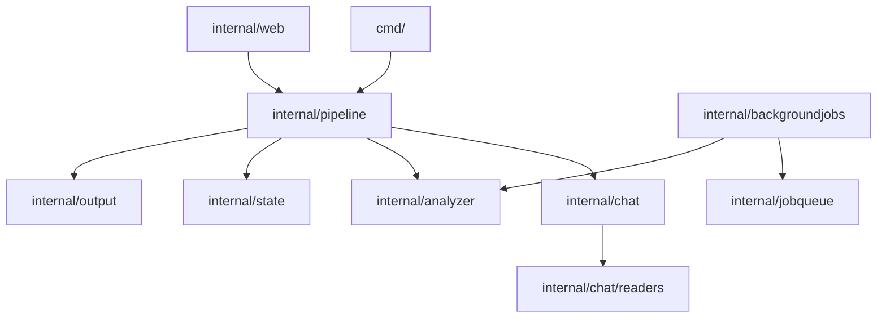

# Dreamer Architecture

This document describes the design principles, CLI commands, and component architecture of the `dreamer` system. It is kept up-to-date with the codebase.

> For a full end-to-end trace of how data moves through every subsystem — from chat discovery through LLM analysis to `todos.md` output and the web UI — see **[docs/DATAFLOW.md](DATAFLOW.md)**.

---

## 1. High-Level Design

`dreamer` is a single-binary Go command-line tool (CLI) designed to periodically scan local AI coding assistant chat logs, run them through an LLM provider with rule-based prompts, and append actionable findings to per-project `todos.md` files.

### Design Principles (Dreamer Design Skill)
Consistent with the [.claude/skills/dreamer-design/SKILL.md](../.claude/skills/dreamer-design/SKILL.md):
- **Functional Core, Imperative Shell:** We push side effects (I/O, process execution, file writes) to system edges (like `internal/pipeline/` and package command runners). Core business logic is implemented as pure, side-effect-free functions (e.g., chat message decoding, mistake extraction, and markdown diff merging).
- **Deep Modules / Vertical Slices:** Complexity is encapsulated within focused modules. The API boundary of each slice is kept extremely simple, hiding internal mechanisms like SQL database queries, Bubble Tea TUIs, or platform-specific sandbox APIs.
- **7±2 Cognitive Load Limits:** We limit top-level structure to prevent working memory overload. This applies to package dependencies, CLI flags, and function parameter counts (using options structs for complex configurations).

---

## 2. Command Layer (`cmd/`)

The Cobra command tree defined in `cmd/root.go` maps directly to CLI features. Subcommands are categorized under the following logical groups:

### Core Commands
- `analyze` — Run a one-shot analysis for a single project (`--path` required).
- `daemon` — Run the background daemon to periodically analyze all configured projects. Spawns the embedded web dashboard and the background job execution loop.
- `start` — Start the daemon running in the background as a detached process or service.
- `stop` — Gracefully stop the running background daemon.
- `status` — Report the current running status and health of the daemon process.
- `jobs` — Manage and view background job schedules.
  - *Interactive Dashboard:* Running `dreamer jobs` without subcommands launches an interactive Bubble Tea terminal dashboard.
  - `list` — List all configured background jobs (supports `--json`, `--verbose`, `--since`).
  - `create` — Create a new background job (interactive TUI wizard or non-interactive flags).
  - `edit` — Edit an existing background job configuration.
  - `show` — Display details of a job and its last 10 execution runs.
  - `pause` / `resume` — Toggle the enabled status and update OS system schedules.
  - `delete` — Delete a background job (`--yes` required).
  - `run` — Trigger a job immediately on-demand (supports `--timeout`, `--force`, `--run-token-file`).
  - `runs` — List run execution history for a job (supports `--status` filters).
  - `logs` — Fetch per-run logs from the LLM provider (supports `--tail`, `--follow`).
  - `reconcile` — Sync OS system schedulers (cron, systemd, plist, schtasks) with the store.
  - `health` — Check job scheduler health diagnostics.

### Setup & Configuration Commands
- `setup` — Interactive terminal setup wizard that initializes or overwrites `config.yaml`.
- `add [path]` — Add a new project path to `config.yaml` using comment-preserving YAML node parsing.
- `remove` — Safely remove a project from `config.yaml` and clean up shadowing keys from the overlay.
- `startup install|uninstall|status` — Platform-specific OS integration (Windows Task Scheduler, Linux systemd, macOS launchd) to run the daemon on system boot.
- `version` — Display build version, commit hash, and Go version.
- `update` — Check for updates and download/install the latest version safely.

### Inspect & Internal Commands
- `ls-chats` — Discovery debug command to list all discovered chat log sources for a path.
- `web` — Command to open the running daemon's web dashboard in the default browser.
- `mcpserver` (Hidden) — Spawns the Model Context Protocol (MCP) server over `stdio` transport. Used to bridge sandboxed LLM providers back to dreamer tools.
- `recordfinding` (Hidden) — Internal CLI wrapper used to append validated findings from isolated shells.

---

## 3. Package Structure & Core Slices

The codebase is structured around strictly separated vertical slices. Under the **7±2 Package Rule**, each slice owns its types and logic and avoids circular dependencies.

### Dependency Routing Table

| Package | Owns / Manages | Permitted Dependencies | Strict Isolation Rules |
| :--- | :--- | :--- | :--- |
| `internal/chat/` | Discovery, path-scoping and registry | `internal/fsutil/`, `internal/logging/` | **Must NOT** depend on `analyzer` or `output`. |
| `internal/chat/readers/` | File and database decoders (JSONL, SQLite) | `internal/chat/` | **Must NOT** depend on `pipeline` or `analyzer`. MESSAGE PARSING IS PURE. |
| `internal/analyzer/` | LLM SDK bindings, orchestrator, permission rules | `internal/sandbox/`, `internal/config/` | **Must NOT** depend on `chat` or `output`. |
| `internal/sandbox/` | bubblewrap (Linux), SBPL (macOS), SID Deny (Windows) | `internal/logging/` | Pure system edge. OS-level containment. |
| `internal/output/` | Todo markdown creation, merging and deduplication | `internal/fsutil/` | **Must NOT** depend on `chat` or `analyzer`. MERGE IS PURE. |
| `internal/config/` | YAML loaders, overlays, structural validation | `internal/logging/` | Global config mapping and UI preference shadow overlays. |
| `internal/state/` | Run caching, state records, finding lifecycles | `internal/fsutil/` | Run-to-run state records. |
| `internal/pipeline/` | Orchestration shell, caching checks, main workflow | All core packages | Orchestrates the entire analysis lifecycle. |
| `internal/backgroundjobs/`| OS scheduler integrations, jobs JSON stores | `internal/analyzer/`, `internal/jobqueue/` | Manages OS system schedules and locks. |
| `internal/jobqueue/` | Concurrent job queues and SQLite/file tracking | `internal/logging/` | Worker pool concurrency management. |
| `internal/mcpserver/` | MCP validation rules and tool execution | `internal/categories/`, `internal/fsutil/` | Handles record-finding protocol and validation caps. |
| `internal/migrate/` | Schema migration framework for persisted JSON | None | **Must be completely pure**. Pure transformations (`[]byte` to `[]byte`). |

---

## 4. Key Subsystems & Lifecycle Details

### Analysis Pipeline Workflow (`internal/pipeline/pipeline.go`)
1. **Derivation:** Resolve the absolute path and unique `project-basename-hash` folder name.
2. **Configuration:** Load global configuration, overlay `ui-overrides.yaml` preferences, and resolve the provider blocks.
3. **Discovery:** Call `chat.DiscoverChats` in parallel (via `errgroup`). Normalizes path symbols and scopes logs to the project path.
4. **Cache Check:** Compute chat and head-SHA hashes. If identical to `state.json` (and `--force` is false), bypass analysis.
5. **Rule Pack Assembly:** Combine built-in rules, customized pack overrides, and category enablement toggles.
6. **Redaction & Decryption:** Read messages from the source via format decoders, run the stream through regex and list redactors to strip secrets.
7. **Session Setup:** Initialize the LLM provider session inside the OS sandbox wrapper (read-only project mount, isolated networks, system resource caps).
8. **Orchestration:** Run multi-phase prompt extraction (Mistakes -> Guardrails). Deduplicate against `state.FindingHashes` (dismissed hashes are pre-filtered so they are never re-synthesized).
9. **Todos Output:** Append new finding markdown blocks to `<output_root>/<project>/todos.md` with explicit `<!-- dreamer:finding:<hash> -->` HTML hashes.
10. **State Update:** Save absolute run counts, cumulative usage counters, and updated state cache arrays to `state.json`.

### Config Overlay Mutexes (`internal/config/overlay.go`)
`dreamer` supports hot-reloading configurations. When users modify settings via the Web UI (`PUT /api/settings`), updates are written to `ui-overrides.yaml` in the user's config directory.
- **Scalars:** Override base fields if non-zero.
- **Maps:** Deep merge keys.
- **Lists:** Overlay list *replaces* base configuration lists completely to avoid merging arrays.
- **FSWatch:** The daemon watches configuration files using `fsnotify`. Reloading compiles a new atomic configuration pointer swaps cleanly, alerting the daemon event bus.

### OS Sandbox Containment (`internal/sandbox/`)
Guarantees side-effect containment for child processes spawned by LLM agents:
- **Linux:** Uses `bubblewrap` (`bwrap`) to perform read-only bind mounts (`--ro-bind / /`), isolate user/pid namespaces, drop network access, and apply custom seccomp profiles.
- **macOS:** Employs seatbelt profiles (`sandbox-exec` SBPL) to block system socket binds, limit filesystem accesses, and block Mach services.
- **Windows:** Constructs a custom restricted security identifier (SID) token with restricted write ACLs and wraps running trees in a Win32 Job Object for lifecycle cleanups.

> For the full per-OS threat model, known limitations, testing requirements, and the four-function backend contract, see **[docs/SANDBOX.md](SANDBOX.md)**.

### Provider System (`internal/analyzer/providers/`)
Sixteen provider implementations across two transport archetypes (CLI stream-JSON and ACP JSON-RPC 2.0). All providers register via `init()` using `analyzer.RegisterProvider` and `analyzer.RegisterProviderMeta`. The shared `cliharness` package drives CLI providers; `acpcore` drives ACP providers.

> For the `Provider`/`Session` interface contract, ACP wire protocol, permission handler wiring, Phase 2 transports, and required tests for adding a new provider, see **[docs/PROVIDERS.md](PROVIDERS.md)**.

### Security Model
Dreamer applies defence-in-depth: secret redaction before sending transcripts to the LLM, a policy-layer permission handler for tool calls, OS-level sandbox containment for subprocesses, CSRF + DNS-rebinding protection for the web dashboard, and run-token authentication for background job execution.

> For the full threat model, trust boundaries, redaction guarantees, web security layer, and known security gaps with planned mitigations, see **[docs/SECURITY.md](SECURITY.md)**.

### Background Jobs Engine (`internal/backgroundjobs/`)
Enforces strict cross-process locking and execution bounds:
- **Locked CRUD:** Uses `<output_root>/background-jobs/store.lock` to coordinate CRUD operations on `jobs.json`.
- **Run Security:** OS scheduler tasks execution triggers `dreamer jobs run <id> --run-token-file <path>`. The runner checks this token against `<store_dir>/run.token` to prevent unauthenticated executions.
- **Reconciler:** Periodically syncs job specifications inside `jobs.json` with platform schedulers, resolving drifts, registering orphans, and checking system health states.
- **Reconciler:** Periodically syncs job specifications inside `jobs.json` with platform schedulers, resolving drifts, registering orphans, and checking system health states.

### Model List Cache (`internal/analyzer/modellistcache.go`)
`ModelListCache` caches live provider model lists with a 5-minute in-memory TTL. On daemon startup (`web.Server.attachAPI`), the cache is pre-warmed from `<output_root>/model-list-cache.json` (7-day disk TTL) so the settings UI shows a useful model picker immediately without waiting for a background provider fetch. After each successful `ListModels` call, the background goroutine in `enrichWithLiveModels` calls `ModelListCache.Save(outputRoot)` to persist the result atomically.

The `GET /api/provider-meta` response includes a `model_source` field per provider:
- `"live"` — the models list was served from the in-memory cache (fetched from a running provider at some point since daemon start)
- `"static"` — no cache entry yet; the static `defaults.AllModels` fallback was returned

The `setup` wizard's model step uses the same hybrid (`cmd/setup.go`): it shows `mergeModelLists(warm, static)` immediately — `warm` being any list read from the on-disk cache via `ModelListCache.Peek` (TTL-free, unlike `Get`) — then fires an async `tea.Cmd` that probes the selected provider via `analyzer.ModelLister`, merges a fresh list in on success (`modelsFetchedMsg`), and persists it back to `<output_root>/model-list-cache.json`. The static `defaults.AllModels` is the floor; the live list (live order preserved, default first) is layered on top. A "(checking for latest models…)" hint shows while the probe is in flight.

---

## 5. Shared Helpers & Reusable Functions

The codebase has a curated set of shared helper functions and constants that must be used instead of reimplementing equivalent logic inline. The authoritative catalogue is:

> **[docs/SHARED_HELPERS.md](SHARED_HELPERS.md)** — complete reference with signatures, current callers, and a quick-lookup table. Read this before writing any helper, constant, or formula.

Key packages that own cross-cutting reusable helpers:

| Package | Primary reusable helpers |
| :--- | :--- |
| `internal/fsutil/` | `WriteFileAtomic`, `ExpandUserHome`, `NormalizeRootPath`, `PathWithinRoot`, `ResolveSymlinks`, `ListProjectFiles`, `ShouldSkipDir/File` |
| `internal/backgroundjobs/` | `ParseFileAccess`, `MaxPromptSize`, `ValidateWritablePaths`, `ValidateSchedule`, `NextRun`, `GenerateJobID`, `ValidateJobID` |
| `internal/pipeline/` | `ParseLookbackDuration` (unit-to-duration for `since` windows) |
| `internal/state/` | `Load`, `Save`, `LoadHistory`, `StateCache`, `ChatCacheKey`, `HashFile`, `TruncateError`, `FindingStatus*` constants |
| `internal/config/` | `ValidateProjectName`, `IsLifetimeSince`, `DefaultSince`, `AppendProjectToYAML`, `RemoveProjectFromYAML`, `DefaultModelFor`, `RemediationMessage` |
| `internal/categories/` | `ApplyEligible`, `AllApplyEligible`, `All` |
| `internal/logging/` | `Any`, `String`, `ErrAttr` |
| `internal/errs/` | `NotInstalled`, `RateLimit`, `ProviderUnavailable`, `KindOf`, `Is` |
| `internal/web/handlers/` | `buildLifecycleCounts`, `buildProviderHealth`, `findProjectByName`, `parseSinceWindow`, `loadFindingsFor`, `buildFindingView`, `buildScheduleSummary` |
| `internal/analyzer/` | `ModelListCache.Get`, `ModelListCache.Peek`, `ModelListCache.Set`, `ModelListCache.Load(dir)`, `ModelListCache.Save(dir)` — disk-persisted provider model list cache (`Peek` is the TTL-free getter used by the setup wizard) |
